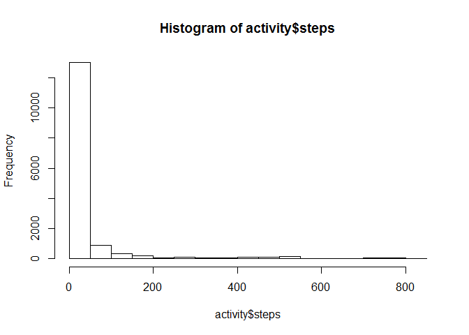
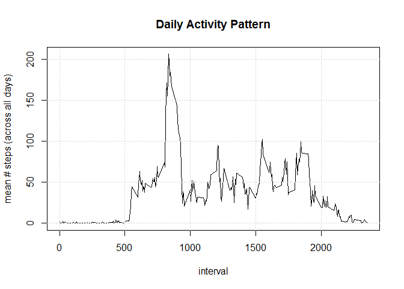
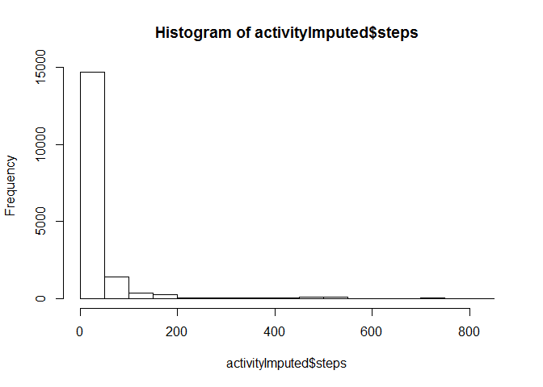

# Reproducible Research: Peer Assessment 1


## Preparation
### forked and cloned RepData_PeerAssesment1 rep, and unzipped 'activity'

## Loading and preprocessing the data


```r
activity <- read.csv('activity/activity.csv')

str(activity)
```

```
## 'data.frame':	17568 obs. of  3 variables:
##  $ steps   : int  NA NA NA NA NA NA NA NA NA NA ...
##  $ date    : Factor w/ 61 levels "2012-10-01","2012-10-02",..: 1 1 1 1 1 1 1 1 1 1 ...
##  $ interval: int  0 5 10 15 20 25 30 35 40 45 ...
```

```r
summary(activity)
```

```
##      steps                date          interval     
##  Min.   :  0.00   2012-10-01:  288   Min.   :   0.0  
##  1st Qu.:  0.00   2012-10-02:  288   1st Qu.: 588.8  
##  Median :  0.00   2012-10-03:  288   Median :1177.5  
##  Mean   : 37.38   2012-10-04:  288   Mean   :1177.5  
##  3rd Qu.: 12.00   2012-10-05:  288   3rd Qu.:1766.2  
##  Max.   :806.00   2012-10-06:  288   Max.   :2355.0  
##  NA's   :2304     (Other)   :15840
```


## What is mean total number of steps taken per day?

<!-- "For this part of the assignment, you can ignore the missing values in the dataset."[https://github.com/rdpeng/RepData_PeerAssessment1/blob/master/README.md]


### "Make a histogram of the total number of steps taken each day"[https://github.com/rdpeng/RepData_PeerAssessment1/blob/master/README.md]

###Calculate and report the mean and median total number of steps taken per day
 -->   
    

```r
# generate histogram of number of steps
hist(activity$steps)
```

 

```r
# calculate the mean number of steps (ignoring NAs):
mean(activity$steps, na.rm=TRUE)
```

```
## [1] 37.3826
```

```r
# calculate the median number of steps (ignoring NAs):
median(activity$steps, na.rm=TRUE)
```

```
## [1] 0
```


<!-- quoted from assignment
    Make a time series plot (i.e. type = "l") of the 5-minute interval (x-axis) and the average number of steps taken, averaged across all days (y-axis)

    Which 5-minute interval, on average across all the days in the dataset, contains the maximum number of steps? -->

## What is the average daily activity pattern?

```r
# calculate the average number of steps taken in each interval, averaged across all recorded days
require(dplyr)
```

```
## Loading required package: dplyr
## 
## Attaching package: 'dplyr'
## 
## The following object is masked from 'package:stats':
## 
##     filter
## 
## The following objects are masked from 'package:base':
## 
##     intersect, setdiff, setequal, union
```

```r
mean_steps_per_interval <- summarise(group_by(activity, interval), m=mean(steps, na.rm=TRUE))

# plot mean steps per interval
plot(mean_steps_per_interval$m ~ mean_steps_per_interval$interval, type="l",
     main="Daily Activity Pattern", xlab="interval", ylab="mean # steps (across all days)"
     )
grid()
```

 

```r
# calculate interval with maximum # steps, averaged across all recorded days
mean_steps_per_interval$interval[mean_steps_per_interval$m == max(mean_steps_per_interval$m, na.rm=TRUE)]
```

```
## [1] 835
```

## Imputing missing values


```r
# calculate the total number observations (rows) with missing values
 sum(!complete.cases(activity))
```

```
## [1] 2304
```

```r
# strategy for imputing missing values: replace NA values with mean value for that interval


# 1. find indices of NAs in activity

na_indices <- which(is.na(activity$steps))

intervalsNAindices <- activity$interval[na_indices]

# 2. look up mean # steps for each missing value, by using the missing value's interval number
# incorrect approach with attempt at vectorization
#replacements <- mean_steps_per_interval$m[intervalsNAindices == mean_steps_per_interval$interval]


# trying again with a for loop (there must be a better way to do this in R, any suggestions?)
replacements <- rep(0, length(intervalsNAindices))
for (i in  1:length(intervalsNAindices) ) {
    replacements[i] <- mean_steps_per_interval$m[mean_steps_per_interval$interval == intervalsNAindices[i]]
}

# 3.  create a new dataset and replace missing values with mean-per-interval values
activityImputed <- activity

activityImputed$steps <- replace(activity$steps, na_indices, replacements)

# 4. double-check for missing values
anyNA(activityImputed)
```

```
## [1] FALSE
```

```r
# 5. compare stats to original summary
summary(activityImputed)
```

```
##      steps                date          interval     
##  Min.   :  0.00   2012-10-01:  288   Min.   :   0.0  
##  1st Qu.:  0.00   2012-10-02:  288   1st Qu.: 588.8  
##  Median :  0.00   2012-10-03:  288   Median :1177.5  
##  Mean   : 37.38   2012-10-04:  288   Mean   :1177.5  
##  3rd Qu.: 27.00   2012-10-05:  288   3rd Qu.:1766.2  
##  Max.   :806.00   2012-10-06:  288   Max.   :2355.0  
##                   (Other)   :15840
```

   

```r
# generate histogram with imputed-data dataset
hist(activityImputed$steps)
```

 

```r
# calculate mean number of steps (ignoring NAs):
mean(activityImputed$steps, na.rm=TRUE)
```

```
## [1] 37.3826
```

```r
# Median number of steps (ignoring NAs):
median(activityImputed$steps, na.rm=TRUE)
```

```
## [1] 0
```

## Are there differences in activity patterns between weekdays and weekends?

```r
# add new factor to distinguish weekends & weekdays
week_pattern <- factor(weekdays(as.Date(activityImputed$date)) %in% c("Saturday", "Sunday"))
levels(week_pattern)<- c("weekday", "weekend")  # false == 0 == weekday; true == 1 == weekend

activityImputed$week <- week_pattern

# seperate average per interval for weekends and weekday 

weekend_activity <- activityImputed[activityImputed$week=="weekend",]
weekday_activity <- activityImputed[activityImputed$week =="weekday",]


mean_activityImputed_weekends <- summarise(group_by(weekend_activity, interval), meanSteps=mean(steps))


mean_activityImputed_weekdays <- summarise(group_by(weekday_activity, interval), meanSteps=mean(steps))

# add column for weekend/weekday factors (used later in merged dataframe)
mean_activityImputed_weekends$week <- as.factor("weekend")
mean_activityImputed_weekdays$week <- as.factor("weekday")


# create dataframe for convenient plotting
#weekly_trends <- data.frame(interval=activityImputed)

weekly_trends <- merge(mean_activityImputed_weekdays, mean_activityImputed_weekends, all=TRUE)


# generate panel plot for weekends and weekdays
library(lattice)

xyplot(meanSteps ~ interval | week , data=weekly_trends, type="l", layout=c(1,2), ylab="Number of steps", xlab="Interval")
```

 

## References
https://github.com/rdpeng/RepData_PeerAssessment1/blob/master/README.md
 http://stackoverflow.com/questions/4827930/how-to-show-indexes-of-nas
 http://stackoverflow.com/questions/14634964/how-does-one-change-the-levels-of-a-factor-column-in-a-data-table


